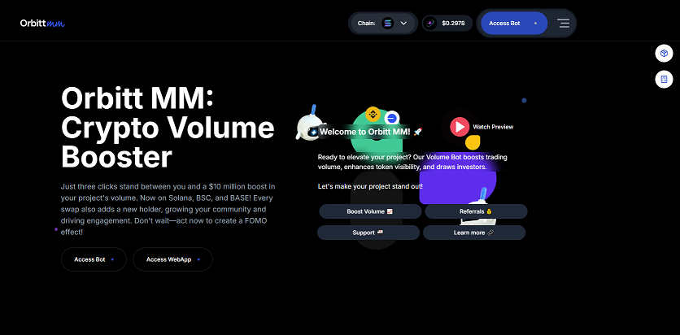
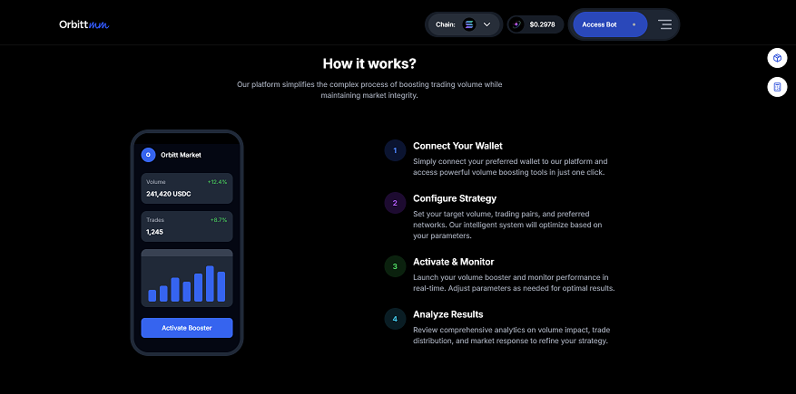
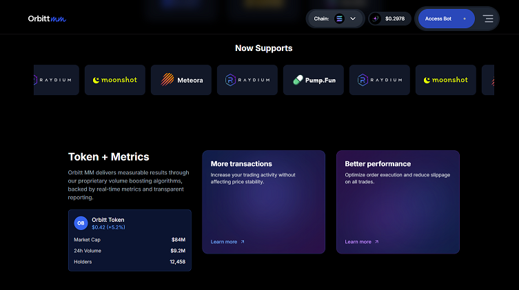
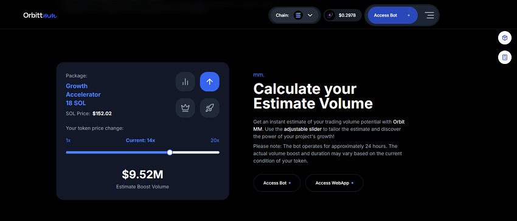

# Frontend Cryptocurrency
This repository serves as a cryptocurrency exchange platform (with Next + TailwindCSS + Vite).

## Overview

### Landing

### HowItWorks

### Token

### Estimator

## Features
- **Persistent Cart with Local Storage**
- Angular Material (Paginator, ErrorStateMatcher, ...)
- Reactive Forms
- Form Validators (built-in + custom)
- Guard
- Routing
- Interceptor
- Custom Directive
- Modules
- ChangeDetectionStrategy.OnPush
- RxJS
- Toggle Password Visibility
- Lazy Loading (lazy-loaded route)
- Content Projection
- ...

## Getting Started
### Next
#### Prerequisite 
- Node.js
- Vite CLI
#### Installation
- Clone the repository
<pre><code> $ git clone https://github.com/KStar1014/crypto_orbitt_frontend  </code></pre>
- Install the project dependencies
<pre><code> $ npm install </code></pre>
#### Run

### Vite
#### Run

